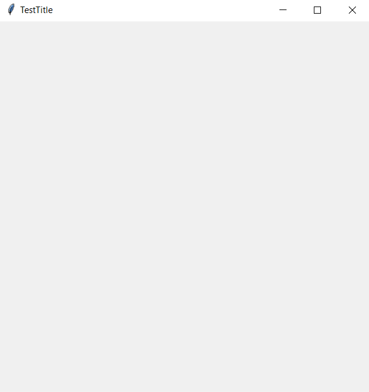
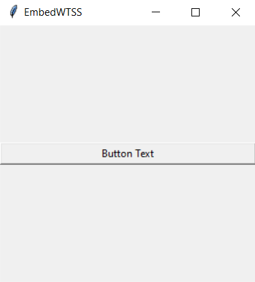
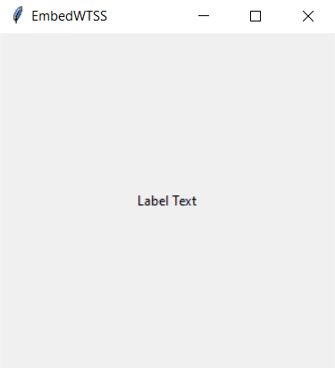
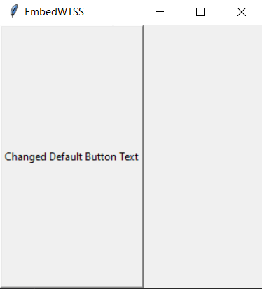

EmbedWTSS
---
EmbedWTSS is a lightweight programming language. 
EmbedWTSS is designed to make program easily and quickly.
Although still in development can be used. 
If you are don't know any programming language, still you can be write with 
easily syntax. Syntax looks like english.

Using
---
First we are creating new file "test.ss"

We write this to "test.ss" file
```
set window.title to TestTitle;
set window.width to 500;
set window.heigth to 500;
run;
```
### Note: All vars is non-required
- window.title var is setting will open window title
- window.width var is setting will open window width
- window.heigth var is setting will open window heigth


Now, you can use with .ss file.

```
EmbedWTSS.exe test.ss
```

### Console Result
```
Entering Interpreter mode
Please enter a command >
```

### Result


---
If we want re-start app without close
```
Entering Interpreter mode
Please enter a command > run file://test.ss;
```
Console looks like.

- run command is a comprehensive command. Let's see examples

### Creating New Window

```
add window.test;
set window.test.title to New Window Test Title;
run window://window.test;
```

Now, we are created new window using **add** and **run**.

- add is a function for adding new variables. We are in future add new buttons and labels with **add** function.
- run is a function for starting any window/files. If you are want run files, just add **file://(file_path);** after the **run** command. 
Also if you are want run window, just add **window://window.(window_name);** after the **run** command.

### Run Function
- run function is a comprehensive command and function, for starting any window/files. If you are want run files, just add **file://(file_path);** after the **run** command. 
Also if you are want run window, just add **window://window.(window_name);** after the **run** command.

```
add window.test;
set window.test.title to New Window Test Title;
run window://window.test;
```
Now we are use run function for run window. if you are want run window, you can run the code at the top

```
run file://test.ss;
```
Now we are use run function for run file. if you are want run file, you can run the code at the top

### Add Function
- add is a function for adding new variables. Add Function is use create an labels, buttons, windows...

```
add button.test;
```

Now we are added new button to code env. The default settings at the bottom.
```
{"button": {"button.text": "TeamWTSS", "button.side": "left", "button.expand": False,
                   "button.fill": BOTH, "button.padx": False, "button.pady": False}
```
If we are not set any value, valid of default settings.

### Set Function

- set is a function for editing/setting variables (buttons, windows, labels...). Set function can use in editing variables.

 ```
add button.test
set button.test.text to TestText;
run;
```

Now we are set button text. We set variable syntax is look like `button.VAR_NAME.VAR_VALUE`.

#### Set Function Syntax

```
set VARIABLE_TYPE.VARIABLE_NAME.VARIABLE_VALUE to DESIRED_VARIABLE_VALUE_TO_BE_SET
```
Example:
```
set button.test.text to button test text;
```

#### Add Function Syntax
```
add VARIABLE_TYPE.VARIABLE_NAME;
```
Example:
```
add button.test;
```

### Booleans
- booleans sets setter true or false for the code requested code.

####Example of True Boolean
```
add button.test;
set button.test.expand to s(bool{true})
run;
```
or
```
add button.test;
set button.test.expand to s(boolean{true})
run;
```         

#### Example of False Boolean
```
add button.test;
set button.test.expand to s(bool{false})
run;
```    
or
```
add button.test;
set button.test.expand to s(boolean{false})
run;
```    

Variable Types
---
- button
- label
- window (we won't don't see here)

### Button
- Button Default Settings
```
{"button.text": "TeamWTSS", "button.side": "left", "button.expand": False,
                   "button.fill": BOTH, "button.padx": False, "button.pady": False}
```
- Button var definitions
  - button.text = The text to write on the button.
  - button.side = The position side on the button
  - button.expand = Sort Order. 
  - button.fill = How much button will fill the page.
  - button.padx = Button X Position (If this false, automate setter.)
  - button.pady = Button Y Position (If this false, automate setter.)

#### Examples
```
add button.test;
set button.test.text to Button Text;
set button.test.side to top;
set button.test.expand to s(bool{true});
set button.test.fill to x;
set button.test.padx to 10;
set button.test.pady to s(bool{false});
run;
```
Result:



### Label
- Label Default Settings
```
{"label.text": "TeamWTSS", "label.side": "left", "label.expand": False,
                  "label.fill": BOTH, "label.padx": False, "label.pady": False}
```
- Label var definitions
  - label.text = The text to write on the label.
  - label.side = The position side on the label
  - button.expand = Sort Order. 
  - label.fill = How much button will fill the page.
  - label.padx = Label X Position (If this false, automate setter.)
  - label.pady = Label Y Position (If this false, automate setter.)

#### Examples
```
add label.test;
set label.test.text to Label Text;
set label.test.side to top;
set label.test.expand to s(bool{true});
set label.test.fill to x;
set label.test.padx to 10;
set label.test.pady to s(bool{false});
run;
```
Result:



### Windows
- Windows Default Settings
```
{"window.title": "EmbedWTSS", "window.width": 300, "window.heigth": 300}
```
- Window var definitions
  - window.title = The text to write on the Window Title.
  - window.width = The width of window.
  - window.heigth = The heigth of window.

#### Examples
```
set window.title to Test Title;
set window.heigth to 500;
set window.width to 500;
run;
```

Result:


### Defaults
- Defaults function is changes defaults of variable. Every created new variable, using this default values for set values.

Examples
```
set default.button.text to Changed Default Button Text;
add button.test_button;
run;
```
Result:




